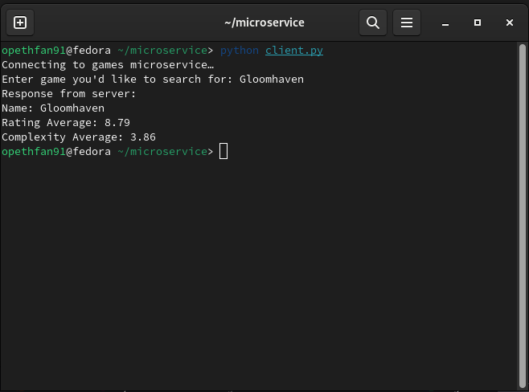
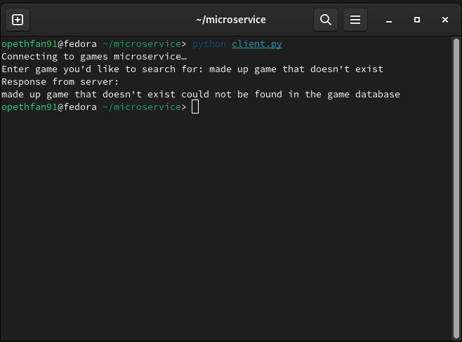
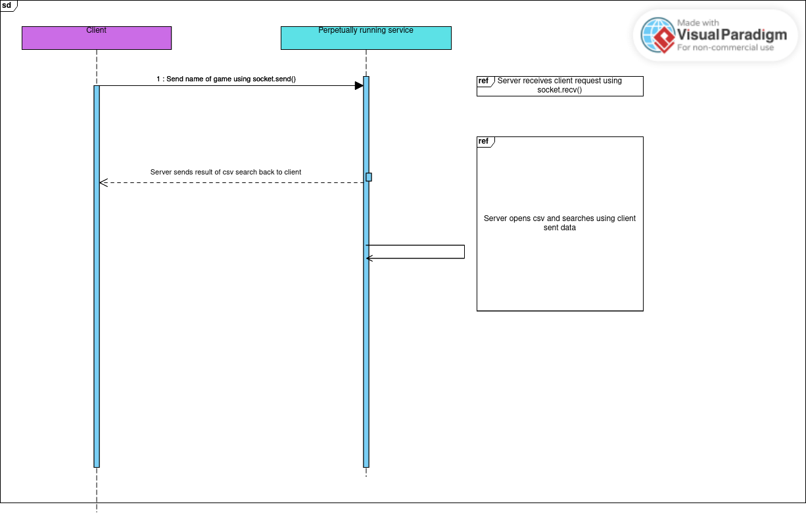

# Microservice for CS 361

This is a small microservice written in Python that receives a request in the form of a string from the main program,
referred to in this implementation as "the client". The microservice will search a database in the form of a csv file 
and send the correct game details back to the client. If the game is not found in the csv file, the server will respond
appropriately.


## Running the server

To run the server, simply run

```bash
  python server.py
```

The server assumes that the name of the csv database is games.csv


## Running the client

To run the server, simply run

```bash
  python client.py
```


## Sending and receiving data from client to server (communication contract)

The mock main program (the client) will:
- Simulate which game the user wishes to search for by asking for the name of a game
- Send that encoded string to the server using the ZMQ Python library on port 5555 using socket.send()

The server (running in a continuous while loop):
- Receive the string from the client using socket.recv()
- Open the csv file and parse the data using the csv import
- If a match is found, the server will send the information as a string using socket.send() in this format:
  - Name: "My Awesome Game"
  - Rating Average: "99.9"
  - Complexity Average: "3.2"
- Once a match is found, the server breaks out of the csv parsing loop and waits for another response from the client.

- Upon a successful match, the client will:
  - Receive the information from the server using socket.recv() and print the information out to the terminal


If no match is found, the server will send an error to the client and wait for another response. The client will print
the error message.

## Example request and sending of data:
- Client 
- ```
  python client.py 
  Connecting to games microservice… 
  Enter game you'd like to search for:
  ```
- User enters "Gloomhaven"
- ```
  client.py:
    socket.send(game_request.encode())
  ```

- Server:
  - ```
    Pseudocode for parsing csv:
    while True:
      with open(game csv file) as gamefile:
        csv_reader = csv.reader(gamefile)
    for each row in the gamefile:
      if the user request matches the name of this particular game row:
        response = this entire row
        socket.send(response.encode)
        break
    if no match:
        socket.send(b"game not found)
  

    ```
- Client:
  - ```
    server response = socket.recv()
    
    print(server response.decode())

    ```

This microservice can be easily modified to not require user input via a
terminal prompt. The service was written like this simply to
demonstrate a string being sent to the microservice.

## Client response if microservice finds game requested in database
- 

## Client response if microservice does not find game requested in database

- 

## UML

